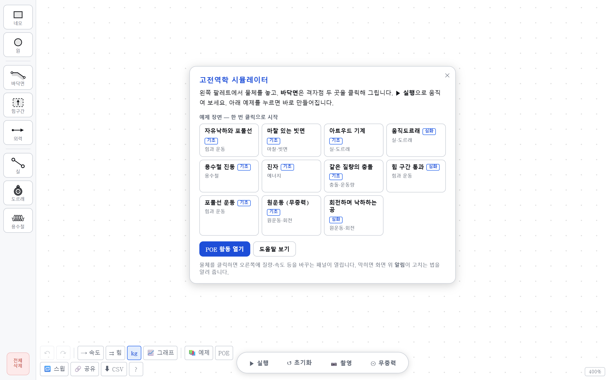
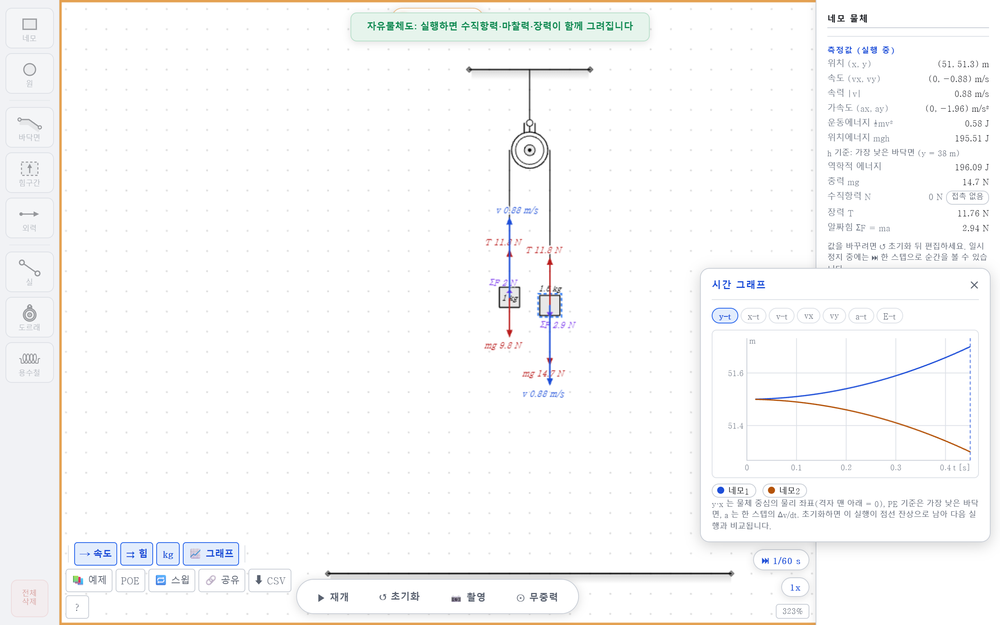
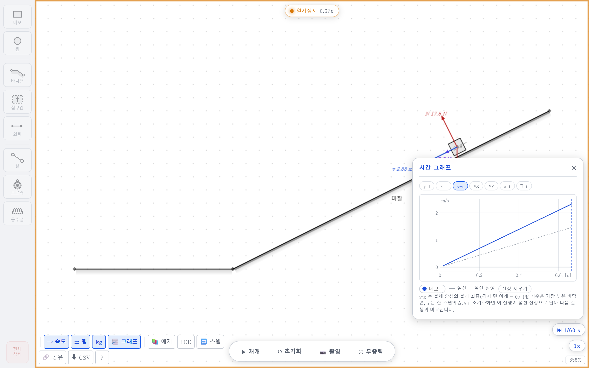
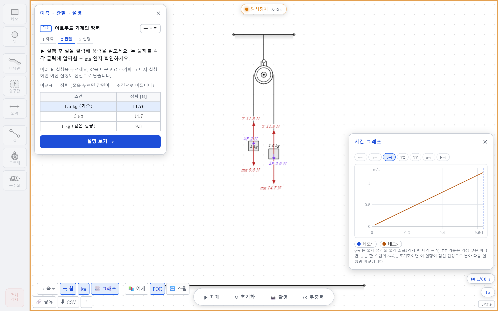
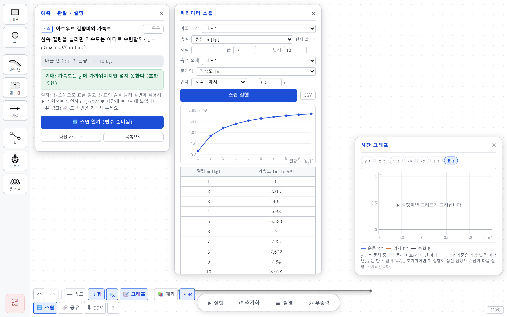
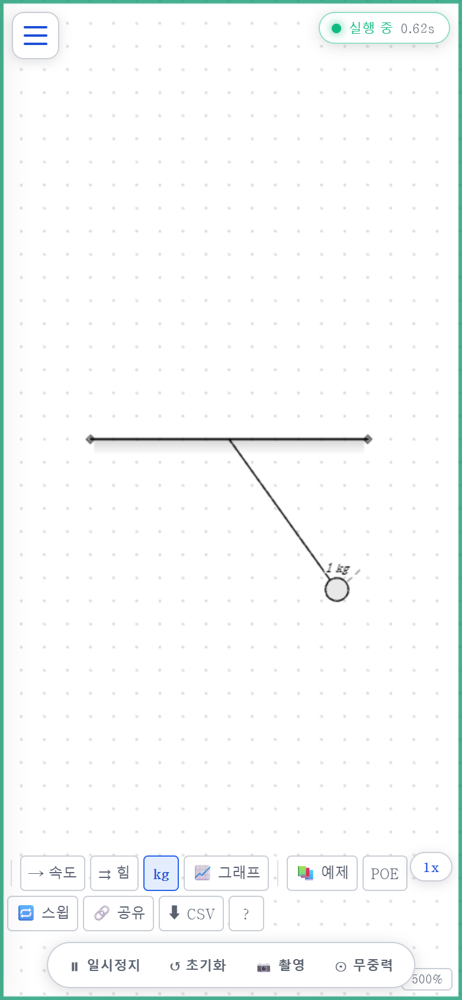

# 고전역학 시뮬레이터 🧲

[](https://shy.ai.kr/mechanics_simulation/)


[](LICENSE)

고등학교 물리 수업용 **웹 고전역학 시뮬레이터**입니다. 물체·바닥면·빗면을 놓고 실·도르래·용수철·외력으로
이으면 중력·마찰·충돌·장력을 그 자리에서 계산해 **속도·힘 벡터(자유물체도)**, **시간 그래프**, **측정값**으로
보여 줍니다. 학생이 먼저 예측하고 확인하는 **POE 활동 24개**, 변수를 바꿔 가며 규칙을 찾는 **파라미터 스윕**,
시험지에 그대로 붙일 수 있는 **수능 규격 선화 내보내기**를 한 화면에 담았습니다.

> **아트우드 기계에서 실의 장력은 어느 무게일까?**
>
> 1 kg 과 1.5 kg 을 걸면 학생 대부분이 "무거운 쪽 무게 14.7 N" 또는 "가벼운 쪽 9.8 N" 이라고 답합니다.
> 실을 클릭하면 **11.76 N** 이 나옵니다 — 두 무게 사이의 값. 왜 그런지는 힘 표시를 켜면 화살표 길이로 보입니다.

### 👉 [**바로 실행하기**](https://shy.ai.kr/mechanics_simulation/)

설치·회원가입 없이 브라우저에서 바로 열립니다. PC·태블릿·스마트폰 모두 지원합니다.
처음 열면 **시작 카드**에 대표 장면 8개가 떠서 한 번 클릭으로 시작할 수 있고,
막히면 **?** 도움말과 화면 위 **상태 알림**(무엇이 잘못됐고 어떻게 고치는지)이 안내합니다.



| 🧱 요소 | 👁 보기 | 📚 수업 |
|---|---|---|
| 네모·원 물체(질량·초기 속도·반발계수·공기저항), 바닥면(직선·꺾임·곡선·마찰), 힘 구간, 외력, 실, 도르래(고정·움직), 용수철 | 속도 벡터 · **자유물체도**(중력·수직항력·마찰력·장력·알짜힘) · 속성 패널 측정값 · **y·x·v·a·E–t 그래프** · 직전 실행 잔상 비교 · 느린 배속·한 스텝 | **POE 24문항**(6분류·오개념 태그·비교표·CSV) · 해설 카드 8 · **탐구 카드 10** · **파라미터 스윕** · 공유 링크 · 수능 규격 SVG 촬영 |

---

## 5분 수업 도입

**📚 예제 → 아트우드 기계**를 누르고 **▶ 실행**. 실행 중에 실을 클릭하면 장력이, 물체를 클릭하면
가속도·알짜힘이 나옵니다. 툴바의 **⇉ 힘**을 켜면 화살표가 함께 그려집니다.

| 무거운 쪽 질량 | 가속도 | 장력 | 무슨 이야기 |
|---|---|---|---|
| **1.5 kg** | 1.96 m/s² | 11.76 N | 장력은 9.8 과 14.7 **사이** |
| **3 kg** | 4.9 m/s² | 14.7 N | 질량 차가 크면 가속도 ↑, 장력은 2m₁g 를 향해 |
| **1 kg** | 0 | 9.8 N | 같은 질량 → 평형, 장력 = 무게 |

> 🔥 **장력은 "무게"가 아니라 "가벼운 쪽을 위로 끌어올릴 만큼"입니다.**
> 이 한 줄이 실·도르래 단원의 절반입니다. 비교표의 줄을 눌러 질량을 바꾸고, 초기화 뒤 다시 실행하면
> 이전 실행이 **점선 잔상**으로 남아 그래프에서 나란히 비교됩니다.



---

## 화면 구성

### 팔레트 (왼쭉)

| 도구 | 하는 일 |
|---|---|
| **네모 · 원** | 클릭하면 화면 가운데에 생깁니다. 끌어서 옮기고, 오른쪽 아래 점을 끌어 크기를 바꿉니다. 바닥면 근처로 끌면 자석처럼 얹히고 빗면이면 기울어집니다 |
| **바닥면** | 격자점 두 곳을 클릭. 왼쪽→오른쪽으로 그리면 **윗면이 실체면**(물체가 얹히는 쪽). 속성에서 직선·ㄱ자·곡선, 마찰(μs·μk)로 바꿉니다 |
| **힘구간** | 구간 안의 물체에 일정한 힘 (Fx, Fy) |
| **외력** | 실로 물체를 이으면 실 방향으로 크기 N 의 힘 |
| **실** | 앵커(●) 두 곳을 차례로 클릭. 도르래 가장자리에 걸면 도르래를 지나는 실 |
| **도르래** | 중심(center)을 실로 바닥면(천장)에 이으면 고정 도르래, 그대로 두면 움직도르래 |
| **용수철** | 양끝에 물체나 벽이 맞닿으면 자동 체결. 한쪽만 붙이면 반대쪽은 고정 핀 |

### 하단 pill

**▶ 실행** (다시 누르면 일시정지) · **↺ 초기화** (t = 0 으로, 직전 실행은 잔상으로) · **📷 촬영** · **⊙ 무중력**.
오른쪽 아래 **배속** (0.25x · 0.5x 로 느리게, 100x 로 빠르게) 과 일시정지 중 **⏭ 한 스텝** (1/60 s).

### 툴바 (왼쪽 아래)

| 버튼 | 켜면 보이는 것 |
|---|---|
| **→ 속도** | 물체마다 속도 벡터와 값 |
| **⇉ 힘** | **자유물체도** — 중력 mg · 수직항력 N · 마찰력 f · 장력 T · 탄성력 · 외력 · 알짜힘 ΣF(보라 점선). 실행하면 실제 값으로 갱신 |
| **kg** | 값 라벨(질량·k·힘). **끄고 촬영하면 값이 빠진 빈 문항 그림** |
| **📈 그래프** | y–t · x–t · v–t · vx · vy · a–t · E–t. 물체별 토글, 직전 실행 점선 겹침 |
| **📚 예제** | 대표 장면 8개 |
| **POE** | 예측·관찰·설명 24문항 + 해설 8 + 탐구 카드 10 |
| **🔁 스윕** | 변수 하나를 여러 값으로 자동 반복 → 표·그래프·CSV |
| **🔗 공유** | 장면이 담긴 링크 복사. 붙여넣으면 그대로 열립니다 |
| **⬇ CSV** | 실행 중 기록된 시각·위치·속도·가속도·에너지 표 |

### 속성 패널 (오른쪽)

물체를 클릭하면 질량·초기 속도·반발계수·공기저항을 바꾸는 입력(키패드)과 그 아래 **측정값**이 나옵니다.
실행 중에는 입력은 잠기고 측정값만 실시간으로 바뀝니다.

| 대상 | 측정값 |
|---|---|
| **물체** | 위치 · 속도 · 속력 · 가속도 · 운동/위치/역학적 에너지 · 중력 · 수직항력 · 마찰력(**정지/운동** 배지) · 장력 · 탄성력 · 알짜힘(**평형** 배지) |
| **실** | 길이 · 팽팽/느슨 · 장력 |
| **용수철** | 길이 · 변형 x · 탄성력 kx · 탄성에너지 ½kx² · 주기 2π√(m/k) |
| **바닥면** | 길이 · 기울기 각 · tan θ 와 μs 비교(**미끄러짐/정지 가능**) |
| **도르래** | 고정/움직 · 걸린 실 · 실 장력 |

> 📐 **가속도는 힘 합산값이 아니라 한 스텝의 Δv/dt 입니다.** 실·충돌·마찰처럼 힘으로 적분되지 않는
> 제약까지 포함한 "실제로 받은" 가속도라서, 알짜힘 ΣF = ma 가 늘 성립합니다. 수직항력·마찰력·장력은
> 이 알짜힘에서 알려진 힘(중력·용수철·외력·물체 간 접촉)을 뺀 잔차를 실 방향·접촉면 기저로 연립해 푼 값입니다.
> 아트우드 장력 2m₁m₂g/(m₁+m₂), 빗면 N = mg cos θ, 정지 마찰 mg sin θ, V자 실 장력 mg/(2cos θ),
> 적층 수직항력 (m₁+m₂)g 가 공식과 수 % 안에서 그대로 나옵니다.



---

## 예측 · 관찰 · 설명 (POE)

툴바의 **POE**(또는 시작 카드의 **POE 활동 열기**)를 누르면 오개념 진단 활동이 열립니다.
문항마다 장면을 불러오고, 학생이 **먼저 답을 고른 뒤**에 실행해 확인하고, 마지막에 설명을 읽습니다.
오답 선택지 하나하나가 알려진 오개념(무거운 것이 먼저 떨어진다, 운동에는 힘이 필요하다, 마찰력은 항상 μN,
장력 = 무게, 진폭이 크면 주기가 길다, 충돌하면 절반 속도로…)이라 어떤 생각으로 틀렸는지 태그로 알려 줍니다.



| 분류 | 문항 |
|---|---|
| **힘과 운동** | 무거운 것이 먼저 떨어질까 · 옆으로 던진 공과 떨어뜨린 공 · 힘이 없으면 멈출까 · 반대 방향 힘을 받는 구간 |
| **마찰·빗면** | 빗면 가속도와 질량 · 미끄러질까 멈춰 있을까 · 마찰로 멈추는 거리와 질량 · 당겨도 움직이지 않을 때의 마찰력 |
| **실·도르래** | 아트우드 장력 · 아트우드 가속도 ✎ · 움직도르래 — 가벼운 쪽이 이긴다? · 진자 최저점의 장력 |
| **용수철** | 진폭과 주기 · 질량과 주기 · 속력이 가장 큰 곳 · 두 배로 누르면 에너지는 |
| **충돌·운동량** | 같은 질량의 탄성 충돌 · 무거운 공이 가벼운 정지 공을 · 완전 비탄성 충돌 ✎ · 가벼운 공이 무거운 정지 공을 |
| **에너지** | 진자 최저점 속력 ✎ · 급한 빗면과 완만한 빗면 · 마찰로 멈추기까지 거리 ✎ · 진자의 에너지 그래프 |

✎ 는 **수치 예측** 문항 — 키패드로 값을 넣고, 시뮬레이션이 실제로 낸 값과 허용 오차 안에서 비교합니다.
많은 문항에 **비교표**가 붙습니다. 줄을 누르면 장면이 그 조건(질량 4배, μs 0.4, 외력 12 N…)으로 바뀌고
측정값이 나란히 채워집니다. 결과는 **CSV 로 내보내** 학급 진단 자료로 쓸 수 있습니다.

**해설** 탭은 문항 없이 대표 장면마다 "이렇게 보세요 · 왜 그럴까"를 단계별로 안내하고,
**탐구** 탭은 탐구 보고서 소재 10개(빗면 각도와 가속도, 질량비와 장력, k 와 주기, 공기저항과 종단속도,
질량비와 충돌 후 속도…)를 시작 장면 + 스윕 프리셋으로 열어 줍니다.

---

## 파라미터 스윕 — 심화 탐구



**🔁 스윕**에서 바꿀 대상(물체·마찰 바닥·용수철·외력·힘구간)과 속성(질량·초기 속도·μ·k·힘·공기저항),
시작·끝·단계 수, 측정할 물리량(속력·가속도·장력·주기·멈추기까지 거리…)과 시점(t 초·최댓값·바닥 도달·정지)을
고르고 **스윕 실행**을 누르면 값마다 장면을 화면 없이 돌려 표와 그래프를 채웁니다.
표의 줄을 누르면 그 조건이 장면에 적용되어 ▶ 실행으로 눈으로 확인할 수 있고, CSV 로 저장해 보고서에 붙입니다.

---

## 수업에서 이렇게 써 보세요

### 활동 1. 무거운 것이 먼저 떨어질까 `기초`

> **발문** — "1 kg 공과 5 kg 공을 같은 높이에서 놓으면 어느 쪽이 먼저 닿을까?"

POE **힘과 운동 → 무거운 것이 먼저 떨어질까**. 예측을 고른 뒤 실행하면 y–t 그래프의 두 곡선이 겹칩니다.
- 비교표에서 질량을 20 kg 으로 바꿔도 도달 시각이 같음을 확인
- 이어지는 발문: "그럼 공기저항이 있으면?" → 속성 패널의 **공기저항 b** 를 1 로 (종단속도 mg/b 가 패널에 뜹니다)

### 활동 2. 빗면 — 미끄러질까 `기초`

> **발문** — "27° 빗면에 μs = 0.6 인 물체를 놓으면 미끄러질까? 마찰력은 얼마일까?"

바닥면을 클릭하면 **tan θ vs μs** 비교가 배지로 뜹니다. 실행해도 물체는 그대로이고, 마찰력은 μs N(10.5 N)이
아니라 **필요한 만큼**(8.77 N)입니다. 비교표에서 μs 를 0.4 로 내리면 미끄러지기 시작합니다.

### 활동 3. 아트우드 — 장력은 어느 무게인가 `기초` ⭐

위 "5분 수업 도입" 그대로. 두 물체를 각각 클릭해 알짜힘이 다르지만 **가속도가 같은** 것을 확인시키세요.
힘 표시를 켜면 장력 화살표가 두 물체에서 같은 길이입니다.

### 활동 4. 움직도르래 — 힘은 절반, 거리는 두 배 `심화`

> **발문** — "1.5 kg 이 2 kg 을 들어 올릴 수 있을까?"

실행 후 두 물체를 클릭해 속력을 비교합니다 — 정확히 1 : 2. 비교표에서 매단 질량을 1 kg 으로 바꾸면 평형.

### 활동 5. 용수철 — 진폭과 주기 `기초`

> **발문** — "더 세게 밀면 한 번 왕복에 더 오래 걸릴까?"

비교표의 초기 속력 1·3·5 m/s 세 줄에서 주기가 모두 1.99 s. 이어서 **탐구 → k 와 주기** 스윕으로
T ∝ 1/√k 를 표로 얻어 보고서에 붙입니다.

### 활동 6. 충돌 — 운동량은 보존되고 운동에너지는 `심화` ⭐

POE **충돌·운동량** 네 문항을 순서대로. 같은 질량(속도 교환) → 무거운 공(2, 6 m/s) → 완전 비탄성(2 m/s, 수치 입력)
→ 가벼운 공(되튐 −2 m/s). E–t 그래프로 탄성 충돌은 운동에너지가 보존되고 비탄성은 절반이 되는 것을 봅니다.

### 활동 7. 시험지 그림 만들기 `수업 준비`

장면을 만든 뒤 툴바의 **kg** 를 꺼 값 라벨을 없애고 **📷 촬영**. 흰 바탕·검정 선 SVG 가 저장됩니다
(수능 물리 문항 작도 규격 — 근거는 [`Design_Suneung_Comparison.md`](Design_Suneung_Comparison.md)).
**🔗 공유**로 같은 장면 링크를 학생에게 주면 각자 기기에서 그대로 열어 실험할 수 있습니다.

---

## 관련 단원

| 과목 | 연결되는 내용 |
|---|---|
| 통합과학 · 물리학Ⅰ | 뉴턴 운동 법칙, 힘의 합성과 평형, 운동량 보존, 역학적 에너지 보존 |
| **물리학Ⅱ** | 빗면·마찰, 실과 도르래(아트우드·움직도르래), 단진동(용수철·진자), 탄성·비탄성 충돌 |
| 융합·창의 | 시뮬레이션 기반 탐구, 변수 통제 실험 설계, 그래프 해석 |

## 이 시뮬레이터가 단순화한 것

수업에서 **함께 짚어 주세요.** 좋은 발문 소재가 됩니다.

| 단순화 | 실제라면 |
|---|---|
| **공기저항은 기본 0** | 켜면 속도에 비례하는 선형 저항만 (F = −bv). 실제는 속도 제곱에 가깝습니다 |
| **실은 늘어나지 않고 질량이 없다** | 실제 실은 조금 늘어나고 무게도 있습니다 |
| **도르래는 무질량·마찰 없음** | 실제 도르래는 관성이 있어 양쪽 장력이 다릅니다 |
| **물체는 회전하지 않는다 (원은 구름 표시만)** | 실제 사각형은 모서리에 걸려 넘어질 수 있습니다 |
| **충돌은 반발계수 하나로** | 접촉 시간·변형은 없습니다 |
| **위치에너지 기준은 가장 낮은 바닥면** | 기준을 어디에 두어도 물리는 같습니다 — 그 자체가 발문입니다 |

---

## 스마트폰에서도 됩니다



왼쪽 위 **☰** 로 팔레트를 엽니다. 그래프·POE·스윕 패널은 화면 폭에 맞게 접힙니다.
학생 개인 기기로 각자 탐구하게 하기 좋습니다 — 링크만 공유하면 됩니다.

---

## 자주 묻는 질문

**Q. 실행했는데 아무 일도 없습니다.**
화면 위쪽 **알림**을 보세요. `움직일 물체가 없습니다`, `실이 걸리지 않은 도르래가 있습니다`,
`용수철이 아무것에도 붙어 있지 않습니다`, `물체가 서로 겹쳐 있습니다` 처럼 원인과 고치는 법이 나옵니다.

**Q. 물체가 바닥을 뚫고 떨어집니다.**
바닥면은 **한쪽 면만** 막습니다. 왼쪽→오른쪽으로 그리면 윗면이 실체면입니다. 반대로 그렸다면 끝점 핸들을 끌어 바꾸세요.

**Q. 장력·수직항력이 안 보입니다.**
실행 중에만 계산됩니다. ▶ 실행 뒤 물체나 실을 클릭하세요. **⇉ 힘**을 켜면 화살표로도 보입니다.

**Q. 그래프가 이전 실행과 겹쳐 보입니다.**
의도된 기능입니다(점선 = 직전 실행). 범례의 **잔상 지우기**를 누르거나 새 장면을 불러오면 사라집니다.

**Q. 값을 바꿨는데 반영이 안 됩니다.**
실행·일시정지 중에는 편집이 잠깁니다. **↺ 초기화** 뒤 바꾸세요.

**Q. 만든 장면을 저장하거나 나눠 줄 수 있나요?**
툴바의 **🔗 공유**를 누르면 장면이 담긴 링크가 복사됩니다. 그림으로는 **📷 촬영**을 쓰세요.

**Q. 수업 자료로 마음대로 써도 되나요?**
네. MIT 라이선스 — 수정·배포·재사용 모두 자유롭게 하셔도 됩니다.

---

## 직접 실행하기 / 고쳐 쓰기

```bash
git clone https://github.com/sehunYang/mechanics_simulation.git
cd mechanics_simulation
python -m http.server 8123     # → http://localhost:8123
```

빌드 도구도 패키지 설치도 필요 없는 **순수 정적 웹앱**입니다.

| 바꾸고 싶은 것 | 파일 |
|---|---|
| 중력 가속도·기본 반발계수·마찰계수·용수철 상수 | `js/config.js` 의 `CONFIG` |
| 배속 단계 | `js/ui-controls.js` 의 `SPEED_LEVELS` |
| 갤러리 장면 | `js/scenes.js` (선언적 DSL) |
| POE 문항·해설·탐구 카드 | `js/poe-data.js` |
| 편집 경고 문구와 고치는 법 | `js/physics.js` `validateAll` · `js/guide.js` `GUIDE_FIX` |
| 색상·서체 | `css/tokens.css` |

검증:

```bash
node test/run-all.js          # 물리·모듈 수치 검증 — 15 스위트 236 항목 (Node, 의존성 없음)
node test/browser/run.js      # 화면에 보이는 값 41 항목 — 헤드리스 Chrome (puppeteer-core)
```

구조와 설계 의도는 **[ARCHITECTURE.md](ARCHITECTURE.md)** 에, 형제 프로젝트
[circuit_simulation](https://github.com/sehunYang/circuit_simulation) 에서 무엇을 어떻게 옮겼는지는
[`Circuit_Port_Analysis.md`](Circuit_Port_Analysis.md) 와 [`Persona_Rubric_Evaluation.md`](Persona_Rubric_Evaluation.md) 에 있습니다.

---

<sub>만든이 · 양세훈 | 교실에서 자유롭게 쓰세요</sub>

## 라이선스

[MIT License](LICENSE) — 출처를 남기면 수업·교재·다른 프로젝트에 자유롭게 쓰고 고쳐 쓸 수 있습니다.
